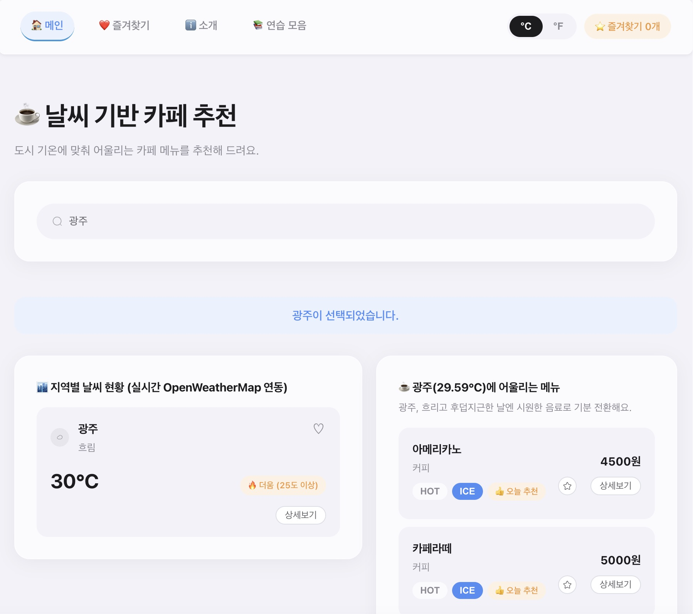

# Weather Dashboard (카페 메뉴 추천)

## 프로젝트 소개

[바로가기](https://skala-vue-dusky-zeta.vercel.app/)

원래의 "날씨 대시보드" 에 카페 메뉴 추천을 더해서 도시
기온에 맞는 메뉴를 골라주는 프로젝트. 

더운 날엔 시원한 메뉴, 선선한
날엔 따뜻한 메뉴 순으로 추천되고, 도시/메뉴 즐겨찾기는 각각 하트(♡)와 별(☆)로
저장됨.

도시 상세 페이지에서는 5일 예보와 미세먼지 지수도 같이 보여줌.

| 화면      | 설명                                    |
| --------- | --------------------------------------- |
| 메인      | 도시별 실시간 날씨 확인, 카페 메뉴 추천 |
| 즐겨찾기  | 즐겨찾기한 도시·카페 메뉴 모아보기     |
| 소개      | 프로젝트 소개, 트러블슈팅               |
| 연습 모음 | Vue 실습 코드 모음집                    |



## 추가한 기능

| 항목        | 내용                                                                                                                                                             |
| ----------- | ---------------------------------------------------------------------------------------------------------------------------------------------------------------- |
| 컨셉        | "날씨 대시보드" 단일 주제에 카페 메뉴 추천을 결합                                                                                                                |
| 데이터      | 도시 9개(대구·인천·광주·대전·울산·전주 6개 추가), 카페 메뉴 8종(아메리카노~콜드브루)                                                                        |
| 반응형 로직 | `recentCities`(최근 조회 도시 3개 기록), `currentSeason`/`recommendedTemp`(기온 기반 HOT/ICE 추천), `recommendCaption`(추천 문구 자동 생성, 16가지 패턴) |
| 컴포넌트/뷰 | `CafeMenuCard`, `CafeMenuDetailView`, `FavoritesView`(즐겨찾기 전용 페이지), `PracticesArchiveView`(연습 아카이브)                                       |
| store 2개   | `cafeStore`(메뉴 HOT/ICE·즐겨찾기), `cityFavoriteStore`(도시 즐겨찾기)                                                                                      |
| API 확장    | 대기질(미세먼지) API 추가 연동 — 현재 날씨 응답의 좌표 재사용                                                                                                   |
| 디자인/UX   | 날씨 상태 6종별 다이내믹 accent 컬러, 반투명 glass UI, 시스템 다크모드 자동 대응, 모바일 햄버거 네비게이션 (애플 macOS/iOS 시스템 앱 스타일)                     |

## 기술 스택

| 기술               | 용도                               |
| ------------------ | ---------------------------------- |
| Vue 3              | Composition API,`<script setup>` |
| Vite               | 개발 서버 · 번들러                |
| Vue Router         | SPA 라우팅                         |
| Pinia              | 전역 상태 관리                     |
| Axios              | HTTP 통신                          |
| Element Plus       | UI 컴포넌트 라이브러리             |
| OpenWeatherMap API | 현재 날씨 / 5일 예보 / 대기질      |

## 파일 구조

```
src/
├── App.vue                    # 앱 셸 — nav(햄버거 반응형), 라우트 전환 애니메이션
├── main.js
├── router/
│   └── index.js               # 라우트 정의
├── views/                     # 페이지 단위 컴포넌트
│   ├── HomeView.vue           # / — 메인 대시보드
│   ├── FavoritesView.vue      # /favorites
│   ├── AboutView.vue          # /about
│   ├── CityWeatherDetailView.vue  # /weather/:cityId — 예보·대기질 포함
│   ├── CafeMenuDetailView.vue     # /cafe/:menuId
│   ├── PracticesArchiveView.vue   # /practices — 수업 실습 아카이브
│   └── NotFoundView.vue       # 404
├── components/
│   ├── assignment/gkyeon/     # 실제 앱에서 쓰는 컴포넌트
│   │   ├── WeatherParent.vue / WeatherCard.vue / CafeMenuCard.vue
│   │   ├── BaseDashboardCard.vue / SearchBar.vue
│   │   ├── UnitToggler.vue / FavoriteCounter.vue
│   │   └── WeatherMockup.vue 등 Mockup 단계 컴포넌트(연습 아카이브용)
│   └── practices/             # 수업 실습 코드 (/practices에서만 렌더링)
│       ├── basic/             # v-directive, lifecycle, slot 등 20여 개
│       └── library/           # Element Plus 코드 챌린지 3개
├── stores/                    # Pinia
│   ├── configStore.js         # 온도 단위(°C/°F)
│   ├── cafeStore.js           # 메뉴 HOT/ICE 선택 · 즐겨찾기
│   └── cityFavoriteStore.js   # 도시 즐겨찾기
├── composables/
│   └── useCityWeather.js      # 실시간 날씨 fetch (Home·즐겨찾기 공용)
├── data/
│   └── menuList.js            # 카페 메뉴 데이터
├── utils/
│   ├── weatherLabel.js        # 날씨 코드 → 한글 라벨
│   ├── weatherTheme.js        # 날씨 상태 → accent 컬러/아이콘
│   └── recommendCaption.js    # 날씨×기온 추천 문구 생성
└── assets/
    ├── base.css                # 디자인 토큰 (라이트/다크 자동 전환)
    └── main.css
```

## 라우트

| 경로                 | 설명                                  |
| -------------------- | ------------------------------------- |
| `/`                | 메인 대시보드 (날씨 + 카페 메뉴 추천) |
| `/favorites`       | 즐겨찾기한 도시·메뉴 모아보기        |
| `/about`           | 소개, 트러블슈팅                      |
| `/weather/:cityId` | 도시 날씨 상세 + 5일 예보 + 대기질    |
| `/cafe/:menuId`    | 카페 메뉴 상세                        |
| `/practices`       | 수업 실습 코드 아카이브               |
| `/:pathMatch(.*)*` | 404                                   |

## 배포 링크

- https://skala-vue-dusky-zeta.vercel.app/

## 단원별 커스터마이징 기록

| 단계            | 구현 내용                                                                                                                                                                                                       |
| --------------- | --------------------------------------------------------------------------------------------------------------------------------------------------------------------------------------------------------------- |
| Mockup          | - 기본 3개 도시(서울/수원/부산) 외 도시 추가<br />- 온도 25도 기준 hot/cool 배지 분기 · 카드 클릭 시 상태바 갱신 <br />- 상세보기 버튼`@click.stop`으로 버블링 차단                                         |
| Composition API | -`computed`로 검색어 기반 도시 필터링(`filteredWeatherList`) <br />- `watch(selectedCity, ...)`로 최근 조회 도시 3개 기록(`recentCities`) <br />- `watchEffect`로 검색어 변경 로그 출력             |
| Component 분리  | -`BaseDashboardCard` / `SearchBar` / `WeatherCard` / `WeatherParent`로 분리 <br />- 카페 메뉴 카드도 `CafeMenuCard`로 별도 분리                                                                      |
| Router          | -`/`, `/about`, `/weather/:cityId`, `/cafe/:menuId`, catch-all(404) · 추가로 `/practices`, `/favorites`                                                                                            |
| Pinia           | -`configStore`(온도 단위 상태·토글) <br />- 추가 store 1 `cafeStore`(메뉴별 HOT/ICE·즐겨찾기) <br />- 추가 store 2 `cityFavoriteStore`(도시 즐겨찾기)                                                 |
| Axios           | - Mock → OpenWeatherMap 실시간 연동(9개 도시)<br />- 5일 예보(정오 값만 축약) 추가 연동 · 대기질(미세먼지) API 추가 연동, AQI 배지 표시 <br />- `try/catch` + `isLoading` 처리                         |
| UI Library      | - Element Plus 선택<br />— 버튼/인풋/아이콘/탭에 적용, 테마 변수를 프로젝트 색상 토큰에 맞게 재정의                                                                                                           |
| Deployment      | - API 키를`.env`로 이전, `.gitignore`에 `.env` 추가 <br />- `npm run build`/`lint` 통과 확인<br />- GitHub 공개 저장소 push([링크](https://github.com/gkyeon/skala-vue)), Vercel 배포, 환경변수 등록 |

## 트러블슈팅

### 1. 전역 CSS 클래스명 충돌로 "상세보기" 버튼이 안 보임

- **증상**: 날씨 카드의 상세보기 버튼이 온도 숫자 뒤에 가려져 클릭이 안 됨
- **원인**: 전역 CSS(`practice.css`)의 `.weather-card`/`.btn-detail`과 클래스명이
  겹쳐 전역 규칙(`position: absolute` 등)이 그대로 적용됨
- **해결**: 클래스명을 `wc-card`/`wc-badge`/`wc-detail-btn`처럼 고유 접두어로 변경

### 2. 날씨 상태가 "온흐림", "실 비"처럼 어색하게 표시됨

- **증상**: 인코딩이 깨진 것처럼 부자연스러운 한글이 나옴
- **원인**: 인코딩 문제가 아니라 OpenWeatherMap `lang=kr` 자동 번역
  (`weather[0].description`) 자체가 부자연스러운 번역이었음
- **해결**: `weather[0].main`(영문 코드) 기준으로 한글 라벨을 직접 매핑하는
  유틸(`weatherLabel.js`) 구현

### 3. 홈 링크가 다른 페이지에서도 항상 활성 색으로 표시됨

- **증상**: `/about`, `/favorites` 등 다른 페이지에 있어도 "🏠 메인" 링크가
  계속 활성 색으로 표시됨
- **원인**: `router-link-active`는 부분 일치 기준이라 모든 경로가 `/`로
  시작하는 이상 항상 활성으로 인식됨
- **해결**: 정확히 일치할 때만 적용되는 `router-link-exact-active` 기준으로 재적용

### 4. `npm run build`가 실패함

- **증상**: 빌드/린트가 아예 안 돌아감
- **원인**: `practices/basic`의 오래된 연습 파일 2개(`VrefSample.vue`,
  `ElementsHandling.vue`)의 문법 오류가 빌드 그래프를 깨뜨림
- **해결**: 문법 오류 수정. ESLint가 잡은 미사용 import·중복 파일 등
  부수 이슈도 같이 정리

### 5. 좁은 화면에서 네비게이션 메뉴가 겹쳐 표시됨

- **증상**: 640px 이하로 화면 폭을 줄이면 링크 4개와 위젯이 한 줄에 겹쳐 표시됨
- **원인**: `nav-links`에 `flex-wrap`만 적용되어 있어 좁은 화면에서 다른
  요소와 공간을 다툼
- **해결**: 640px 미만에서는 링크를 숨기고 햄버거 버튼으로 대체, 클릭 시 드롭다운

### 6. 화면을 극단적으로 좁히면 카드 레이아웃이 깨짐

- **증상**: 화면 폭을 300px 이하로 줄이면 카드 내부 텍스트와 배지가 서로 겹침
- **원인**: 최소 폭 제한이 없어 뷰포트가 좁아질수록 grid/flex가 한계 없이 축소됨
- **해결**: `body`에 `min-width: 320px` 설정, 이하에서는 가로 스크롤 발생

## 실행 방법

```bash
npm install
cp .env.example .env   # .env를 열어서 본인 OpenWeatherMap API 키로 교체
npm run dev
```

( API 키는 `.env`의 `VITE_OPENWEATHER_API_KEY`로만 참조하고, 코드에는 절대
하드코딩하지 않음.

 `.env`는 `.gitignore`에 포함하여 커밋하지 않음. )


## 구현 로직 설명

### 1. 대기질 API의 순차 호출 처리 (`CityWeatherDetailView.vue`)

- 현재 날씨·5일 예보는 `Promise.all`로 병렬 요청이 가능하나, 대기질(미세먼지)
  API는 위도/경도 값이 필요하며 해당 좌표는 현재 날씨 응답에만 포함되어 있음.

- 따라서 현재 날씨·예보는 병렬로 요청하고, 대기질은 현재 날씨 응답의 좌표를
  받은 뒤 순차적으로 요청하도록 구현함.

```js
const [currentRes, forecastRes] = await Promise.all([...])  // 병렬
// currentRes의 coord를 받은 뒤에야 아래 호출이 가능함 (순차)
const airRes = await axios.get(AIR_QUALITY_URL, {
  params: { lat: currentRes.data.coord.lat, lon: currentRes.data.coord.lon, appid: API_KEY },
})
```

- 대기질 요청은 별도의 `try/catch`로 처리하여, 해당 요청이 실패하더라도
  이미 수신한 날씨·예보 데이터 표시에는 영향이 없도록 함.

### 2. 3시간 간격 예보 데이터를 5일치로 축약 (`CityWeatherDetailView.vue`)

- OpenWeatherMap의 5일 예보 API는 3시간 간격으로 하루 8개, 총 40개의
  데이터를 반환함.
- 하루당 대표값 1개만 표시하기 위해 `dt_txt`에 `12:00:00`이 포함된 항목만 필터링하여 정오 기온을 그날의 대표값으로 사용함.

```js
forecastList.value = forecastRes.data.list
  .filter((item) => item.dt_txt.includes('12:00:00'))
  .slice(0, 5)
  .map((item) => ({ date: item.dt_txt.slice(5, 10), temp: item.main.temp, ... }))
```

### 3. 기온 → 계절 → 추천 메뉴로 이어지는 3단 computed 체인 (`WeatherParent.vue`)

- 메뉴 추천 로직은 단일 computed가 아닌, 상호 의존하는 computed 3개로 구성됨.

```js
const currentSeason = computed(() =>
  selectedCity.value ? (selectedCity.value.temp >= 25 ? 'hot' : 'cool') : null,
)
const recommendedTemp = computed(() => (currentSeason.value === 'hot' ? 'ice' : 'hot'))
const recommendedMenu = computed(() =>
  selectedCity.value
    ? menuList.filter((menu) => menu.season === 'always' || menu.season === currentSeason.value)
    : [],
)
```

- `currentSeason`은 도시 기온으로 계절을 판정하고, `recommendedTemp`는
  해당 계절의 반대 온도를 추천함(기온이 높으면 `ice`, 낮으면 `hot`).
- 변수명만으로는 `currentSeason`과 동일한 값을 반환할 것으로 오인하기 쉬운 부분임.

### 4. 사용자 선택이 추천값을 덮어쓰는 가격 계산 (`CafeMenuCard.vue`, `cafeStore.js`)

- 메뉴 가격은 기본적으로 `recommendedTemp`(3번 로직)를 따라 HOT/ICE가
  결정되나, 사용자가 카드에서 직접 선택한 경우 해당 선택이 우선 적용되도록
  구현함.
- `cafeStore.getTempChoice(menuId, fallback)`이 이 우선순위를
  처리함.
- 저장된 선택값이 있으면 이를, 없으면 `fallback`(추천값)을 반환함.

```js
function getTempChoice(menuId, fallback = 'hot') {
  return tempChoice.value[menuId] || fallback
}
```

- 이 구조에 따라 도시를 변경하여 추천값이 달라지더라도, 사용자가 이미
  선택한 메뉴의 HOT/ICE 및 가격은 유지됨.
